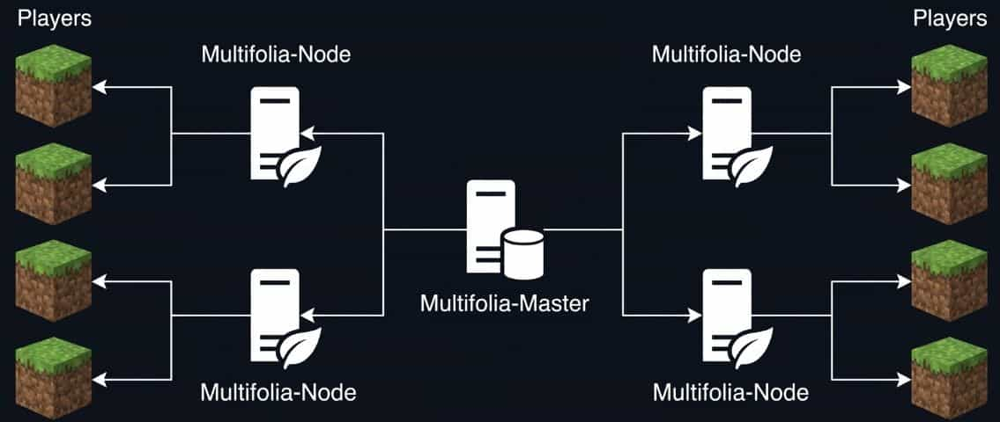

# MultiFolia

---

> [!CAUTION]
>
> **MultiFolia is experimental software.**
>
> This project is intended for testing and development. Do not use it with a production server or an important world until the distributed implementation has been validated.

---

**MultiFolia is a 26.2 experimental fork derived from MultiPaper, with the project being developed toward Folia-compatible distributed region processing.**

The current 26.2 base keeps MultiPaper's multi-server world architecture: multiple server processes can participate in one world while a master coordinates ownership and synchronization.



## MultiFolia goals

The long-term goal is to make each server a real worker rather than only a chunk cache. In the planned architecture, different machines will be able to generate and process their own regions while synchronizing the state needed across region boundaries.

The current 26.2 port is the foundation for that work. **Distributed live chunk generation and Folia region scheduling are not yet complete.**

## Commands

MultiFolia provides a namespaced command interface:

`/mf servers` or `/multifolia servers`  
List servers in the MultiFolia cluster with performance and player information.

`/mf list` or `/multifolia list`  
List online players and the server they are connected to.

`/mf debug` or `/multifolia debug`  
Toggle the chunk ownership/debug visualisation.

`/mf map` or `/multifolia map`  
Show a map of nearby chunks and which server owns them.

The original `/servers`, `/slist`, `/mpdebug`, and `/mpmap` commands remain registered for compatibility while the new MultiFolia namespace is being introduced.

## Setting up MultiFolia

The 26.2 implementation uses the MultiPaper-style master/worker architecture. Configure the master address and a unique server name for each participating server.

The built-in master/proxy components are currently retained from the MultiPaper 26.2 base and will be renamed further as the MultiFolia architecture is completed.

## 26.2 build requirements

- JDK 25 to compile and run the 26.2 server.
- Gradle wrapper supplied by the repository.

Build the server with:

```bash
./gradlew applyPatches
./gradlew createMojmapPaperclipJar
```

## Development status

MultiFolia is currently a development fork. The immediate focus is integrating the 26.2 MultiPaper networking/chunk ownership implementation with Folia-style region ownership and scheduling, followed by distributed chunk generation and stronger worker failure handling.

### Licensing

The code remains licensed under the upstream project's applicable licenses. See `LICENSE.txt` and the component-specific license files for details.

### Acknowledgements

MultiFolia builds on the work of MultiPaper, PaperMC, Purpur, Folia, and the other upstream projects retained in this tree.
